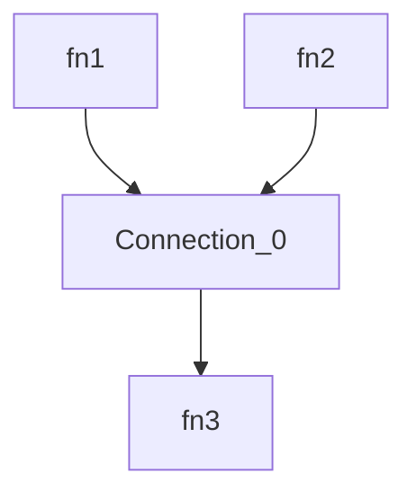
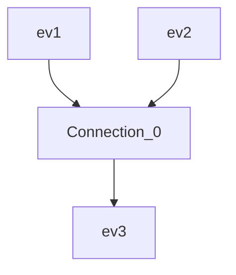
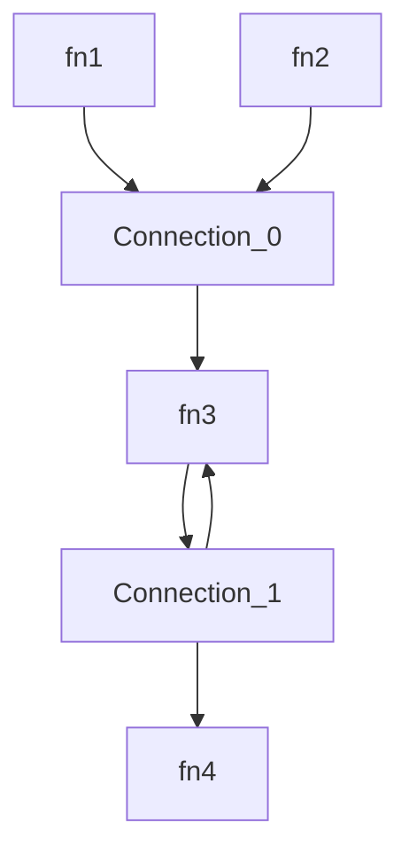

# Isomorphic Orchestrator for JS/TS Functions and Events

This library provides a simple yet powerful, fast, secure, and extensible orchestrator for your JavaScript/TypeScript functions and events, working in both browsers and Node/Bun/Deno, that can be used as base for your own low-code platform or workflow engine.
The orchestration logic is defined as a simple JSON and uses the power of [JSONata](https://jsonata.org/) for input/output transformations.

Highlights:
- Fast: Since v2, new event based engine that immediately reacts on every state change.
- Lightweight: No dependencies except JSONata.
- Secure: Strong input validation + data transformation code provided as a JSONata expression does not need to be sandboxed.
- Extensible: You can use your own state management system and abort signal.
- Isomorphic: Works in a browser as well as on Node/Bun/Deno.
- Typescript types available.
- Open Source (MIT).
- 100% code coverage.
- Simple [Playground](https://damianofalcioni.github.io/js-functions-orchestrator/index.playground.html) (with an AI Agent sample entirely running in your browser)

## Usage

### NodeJS

```shell
npm install js-functions-orchestrator
```

Simple combination of two functions outputs as input for a third one:


```js
import { Orchestrator } from 'js-functions-orchestrator';

const orchestrator = new Orchestrator({
  functions: {
    fn1: async ()=>'Hello', //sync or async functions
    fn2: async ()=>'World',
    fn3: echo=>echo
  }
});
const runResult = await orchestrator.run({
  connections: [{
    from: ['fn1', 'fn2'],
    transition: '{ "to": [[ $.from[0] & " " & $.from[1] ]] }', //the result of fn1 (the string "Hello") is combined with the the result of fn2 (the string "World") and used as input for fn3
    to: ['fn3']
  }]
});

console.log(runResult.state.finals.functions.fn3.at(-1));
/* output:
Hello World
*/
```

Simple combination of two events into a third one:


```js
import { Orchestrator } from 'js-functions-orchestrator';

orchestrator.addEventListener('ev3', event=> console.log(event.detail));
orchestrator.run({
  events: {
    ev1: { once: true },
    ev2: { once: true },
    ev3: { once: true }
  },
  connections: [{
    from: ['ev1', 'ev2'],
    transition: '{"to": [$.from[0] & " " & $.from[1]]}',
    to: ['ev3']
  }]
});
orchestrator.dispatchEvent(new CustomEvent('ev1', {detail:'Hello'}));
orchestrator.dispatchEvent(new CustomEvent('ev2', {detail:'World'}));
/* output:
Hello World
*/
```

A more complex scenario with a loop:


```js
import { Orchestrator } from 'js-functions-orchestrator';

const orchestrator = new Orchestrator({
  functions: {
    echo: echo=>echo
  }
});

const runResult = await orchestrator.run({
  functions: {
    fn1: { ref: 'echo', args: ['Hello']},
    fn2: { ref: 'echo', args: ['World']},
    fn3: { ref: 'echo'},
    fn4: { ref: 'echo'}
  },
  connections: [{
    from: ['fn1', 'fn2'],
    transition: '{ "to": [[ $.from[0] & " " & $.from[1] ]], "global": {"y": 1} }',
    to: ['fn3']
  }, {
    from: ['fn3'],
    transition: '($i:=$.local.i; $i:=($i?$i:0)+1; {"global":{"y":($.global.y+1)}, "local":{"i":$i}, "to": [[ $.from[0] & " " & $string($i)], $i<5 ? [[$.from[0]]] : null ] })',
    to: ['fn4', 'fn3']
  }]
});
console.log(runResult.state.finals.functions.fn4.at(-1));
/* output:
Hello World 5
*/
```

More examples are available in the [index.test.js](./index.test.js).

### Browser

Live at [Github Pages](https://damianofalcioni.github.io/js-functions-orchestrator/index.test.html)

Or try it in the [Playground](https://damianofalcioni.github.io/js-functions-orchestrator/index.playground.html)

```html
<html>
<script type="module">
import { Orchestrator } from 'https://esm.run/js-functions-orchestrator';

const orchestrator = new Orchestrator({
  functions: {
    //sync or async functions
    echo: echo=>echo
  }
});
const runResult = await orchestrator.run({
  functions: {
    fn1: { ref: 'echo', args: ['Hello']},
    fn2: { ref: 'echo', args: ['World']},
    fn3: { ref: 'echo'}
  },
  connections: [{
    from: ['fn1', 'fn2'],
    transition: '{ "to":[[ $.from[0] & " " & $.from[1] ]] }', //the result of fn1 (the string "Hello") is combined with the the result of fn2 (the string "World") and used as input for fn3
    to: ['fn3']
  }]
});
document.body.innerText = runResult.state.results.fn3.result;
console.log(runResult.state.finals.functions.fn3.at(-1));
/* output:
Hello World
*/
</script>
</html>
```

## Logic

The orchestration graph is defined by a list of `connections` between different functions and/or events. A single connection can be `from` multiple functions/events `to` multiple functions/events and may include the transformation logic for the outputs of the `from` functions/events to the inputs of the `to` functions/events. Each connection starts only when all the `from` functions have results and all the `from` events have been received. These results are provided to the transformation logic, when available, and the results of the transformation are the inputs for the different `to` functions/events, which are then executed. Only when the input of a specific `to` function/event is `null` instead of an array of parameters, the execution is skipped.
The execution continue until no more connections can be started. Note that incorrectly designed graphs can lead to infinite executions. As this behavior cannot be predicted at runtime time, the Orchestrator allows to specify an AbortSignal to manually terminate the execution.

## APIs

### Constructor

`@param {Object} [config]` JSON object with the following properties:

`@param {Record<string, Function>} [config.functions]` A JSON object containing as key the function name and as value the function

Example:
```js
const orchestrator = new Orchestrator({
  functions: {
    echo: echo=>echo
  }
});
```

### async run

Run the Orchestrator

`@param {Object} [config]`

`@param {Record<string, FunctionConfig>} [config.functions]` An optional definition of functions to use in the different connections with the following properties:
- `{string} [ref]`: Reference to the name of the function exposed in the Orchestrator instantiation. When not provided the function name is used.
- `{Array<any>} [args]`: When available, will be used as input arguments for the function during its execution at the initialization of the orchestration (only if no state is provided)
- `{Boolean} [throws]`: When true, errors thrown by the functions will be thrown and terminate the orchestration
- `{string} [inputsTransformation]`: When available must contain a JSONata expression to pre-process the function inputs before being passed to the function
- `{string} [outputTransformation]`: When available must contain a JSONata expression to post-process the function output before being used in any connection

`@param {Record<string, EventConfig>} [config.events]` An optional definition of events to use in the different Connections with the following properties:
- `{string} [ref]` Reference to the name of the event to be listened. When not provided the event name is used.
- `{boolean} [once]` When defined as true the orchestrator will expect the event only once and is able to automatically terminate the execution. When false the orchestration should be manually terminated with an AbortSignal (default: false)

`@param {Array<Connection>} [config.connections]` The connections between the services provided as an array of objects with the following properties:
- `{Array<string>} [from]`: The list of the connections from where the data is coming from
- `{string} [transition]`: The JSONata to process the data
- `{Array<string>} [to]`: The list of the connections to where the data is going to

`@param {OptionsConfig} [options]` Configurable options with the following properties:
- `{AbortSignal} [signal]`: An optional AbortSignal to abort the execution

`@param {State} [state]` An optional reference to a state that will be used as starting state for the execution and updated ongoing. State can be composed of the following properties:
- `{Object} [variables]` Object containing global and locals variables
- `{Record<string, any>} [variables.global]` Object containing all the global variables (as keys) with their values, defined in the different connections transitions
- `{Array<Record<string, any>>} [variables.locals]` Array of local variables for each connections defined in each connection transition
- `{Object} [finals]` Object containing the results of the final functions/events/connections (functions/events appearing only in the to, or connections without a to)
- `{Record<string, Array<any>>} [finals.functions]` Object containing for every final function (as a key), an array (as a value) of produced results
- `{Record<string, Array<any>>} [finals.events]` Object containing for every final event (as a key), an array (as a value) of dispatched detail
- `{Array<Array<any>|undefined>} [finals.connections]` Array of connections length containing for every final connection an array of produced results, or undefined for non final connections
- `{Record<string, Array<any>>} [errors]` Object containing for every final function (as a key), an array (as a value) of produced errors
- `{Array<Record<string, Array<any>>>} [waitings]` Array of connections length containing for every connection an object of events (as a key) waiting to trigger the connection execution, with an array (as a value) of their dispatched details
- `{Array<{inputs:Array<any>, id:number|string}>} [runnings]` Array of objects describing a running functions or connections.
- `{Record<string, Array<any>>} [receiveds]` Object containing for every received event (as a key), an array (as a value) of received detail 

`@returns {Promise<{state:State}>}` The function always return a promise that rejects in case of errors or resolves with the state of the Orchestrator composed of the following properties:
- `{Object} [variables]` Object containing global and locals variables
- `{Record<string, any>} [variables.global]` Object containing all the global variables (as keys) with their values, defined in the different connections transitions
- `{Array<Record<string, any>>} [variables.locals]` Array of local variables for each connections defined in each connection transition
- `{Object} [finals]` Object containing the results of the final functions/events/connections (functions/events appearing only in the to, or connections without a to)
- `{Record<string, Array<any>>} [finals.functions]` Object containing for every final function (as a key), an array (as a value) of produced results
- `{Record<string, Array<any>>} [finals.events]` Object containing for every final event (as a key), an array (as a value) of dispatched detail
- `{Array<Array<any>|undefined>} [finals.connections]` Array of connections length containing for every final connection an array of produced results, or undefined for non final connections
- `{Record<string, Array<any>>} [errors]` Object containing for every final function (as a key), an array (as a value) of produced errors
- `{Array<Record<string, Array<any>>>} [waitings]` Array of connections length containing for every connection an object of events (as a key) waiting to trigger the connection execution, with an array (as a value) of their dispatched details
- `{Array<{inputs:Array<any>, id:number|string}>} [runnings]` Array of objects describing a running functions or connections.
- `{Record<string, Array<any>>} [receiveds]` Object containing for every received event (as a key), an array (as a value) of received detail 

`@throws {{error:Error, state:State}}` In case of errors the promise rejects with an object containing the error and the status


Example:
```js
const results = await orchestrator.run({
    // Functions that can be used in the connections. When ref is defined will reference an already available function provided in the constructor. This way we can reuse the function without looping through it.
    // Functions with user-defined input arguments args will start the orchestration. When not defined, initial functions will be identified checking on the connections all the "from" functions that are never connected to a "to".
    "functions": {
      "fn1": { "ref": "echo", "args": ["Hello"]},
      "fn2": { "ref": "echo", "args": ["World"]},
      "fn3": { "ref": "echo" },
    },
    // Events that can be used in the connections.
    "events": {},
    // List of existing connections between functions/events.
    "connections": [{
        // A connection has a "from" array, containing the identifiers of the functions/events that originate the connection. The connection starts only when all the functions/events in the "from" array have been executed and have a result. In this case their results are made available in the JSONata of the "transition". If the "from" is missing or empty the connection starts automatically.
        "from": ["fn1", "fn2"],
        //JSONata expression that must return at least the JSON { "to": [] }. "to" must be an array of the same size of the "connection.to" array, containing an array of input parameters (as array) for the relative "connection.to" function. Additionally it can return "global", and "local", to store respectively globally and locally scoped variables (a global variable is visible in all the connection transitions, while a local variable only in the same transition but across multiple executions). If the transition is not provided the output of the "from" functions/events are provided directly as inputs to the "to" functions/events. In this case "from" and "to" arrays must be of the same size.
        "transition": "{\"to\": [[ $.from[0] & \" \" & $.from[1] ]]}",
        // List of functions/events that can consume the output of the "transition" as their inputs. The functions are executed. The events are triggered. 
        "to": ["fn3"]
    }]
}, { signal: AbortSignal.timeout(1000*60*5) }); //Abort the execution if it takes longer than 5 minutes
/*
results:
{
  state: {
    results: { fn3: { result: 'Hello World'} },
    variables: { global: {}, locals: [ {}, {} ] }
  }
}
*/
```

## Events

- `state.change` : Trigger every time there is a state change (i.e. connection executed). State is returned in the event (`CustomEvent`) `detail`.
- `success` : Trigger at the end of an orchestration that did not produce errors. State is returned in the event (`CustomEvent`) `detail`.
- `error` : Trigger at the end of an orchestration that produced errors. State and error are returned in the event (`CustomEvent`) `detail`.
- `errors` : Trigger every time a function throws an error.
- `errors.<fn>` : Trigger every time the specified `<fn>` function throws an error.
- `functions` : Trigger every time a function returns a result.
- `functions.<fn>` : Trigger every time the specified `<fn>` function returns a result.
- `events` : Trigger every time a connection event is dispatched.
- `events.<event>` : Trigger every time the specified connection `<event>` is dispatched.
- `logs` : Trigger on every logged event (debug purpose). level (0-5), type (ALL, DEBUG, INFO, WARN, ERROR, FATAL), and message are returned in the event (`CustomEvent`) `detail`.