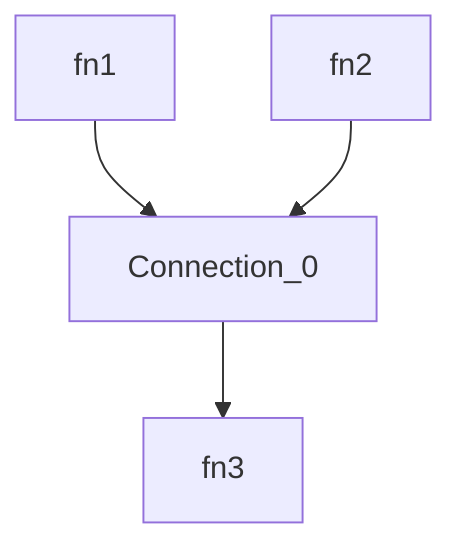
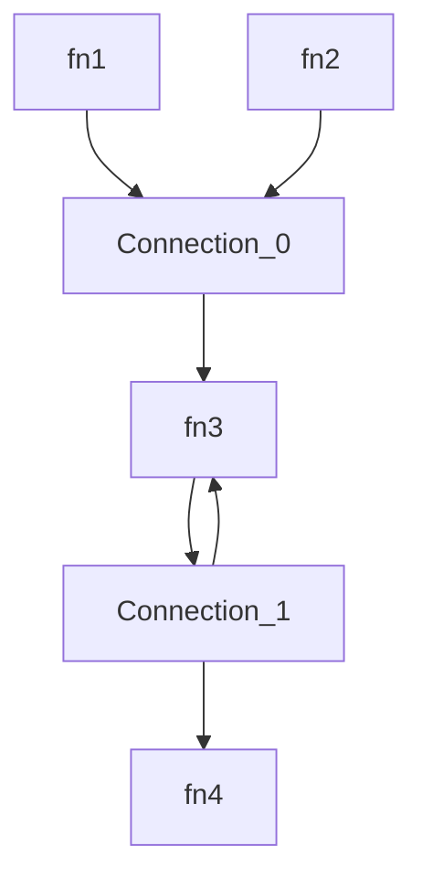

# Isomorphic Orchestrator for JS/TS Functions

This library provides a simple yet powerful, fast, secure, and extensible orchestrator for your JavaScript/Typescript functions, working both in browsers and Node/Bun/Deno, that can be used as base for your own low-code platform.
The orchestration logic is defined in a simple JSON and uses the power of [JSONata](https://jsonata.org/) for input/output transformations.

Highlights:
- Lighweight: The full orchestration logic is ~100 LoC. No dependencies except JSONata.
- Secure: User code provided as a JSONata expression does not need to be sandboxed.
- Extensible: You can provide your own state management system and abort signal.
- Isomorphic: Works in a browser as well as on Node/Bun/Deno.
- Typescript types available.
- Open Source (MIT).
- 100% code coverage.
- Simple [Playground](https://damianofalcioni.github.io/js-functions-orchestrator/index.playground.html)

## Usage

### NodeJS

```shell
npm install js-functions-orchestrator
```

Simple combination of two functions outputs as input for a third one:


```js
import { Orchestrator } from 'js-functions-orchestrator';

const orchestrator = new Orchestrator({
  functions: {
    fn1: async ()=>'Hello', //sync or async functions
    fn2: async ()=>'World',
    fn3: echo=>echo
  }
});
const runResult = await orchestrator.run({
  connections: [{
    from: ['fn1', 'fn2'],
    transition: '{ "to": [[ $.from[0] & " " & $.from[1] ]] }', //the result of fn1 (the string "Hello") is combined with the the result of fn2 (the string "World") and used as input for fn3
    to: ['fn3']
  }]
});

console.log(runResult);
/* output:
{
  state: {
    results: { fn3: { result: 'Hello World' } },
    variables: { global: {}, locals: [ {} ] }
  }
}
*/
```

A more complex scenario with a loop:


```js
import { Orchestrator } from 'js-functions-orchestrator';

const orchestrator = new Orchestrator({
  functions: {
    echo: echo=>echo
  }
});

const runResult = await orchestrator.run({
  functions: {
    fn1: { ref: 'echo', args: ['Hello']},
    fn2: { ref: 'echo', args: ['World']},
    fn3: { ref: 'echo'},
    fn4: { ref: 'echo'}
  },
  connections: [{
    from: ['fn1', 'fn2'],
    transition: '{ "to": [[ $.from[0] & " " & $.from[1] ]], "global": {"y": 1} }',
    to: ['fn3']
  }, {
    from: ['fn3'],
    transition: '($i:=$.local.i; $i:=($i?$i:0)+1; {"global":{"y":($.global.y+1)}, "local":{"i":$i}, "to": [[ $.from[0] & " " & $string($i)], $i<5 ? [[$.from[0]]] : null ] })',
    to: ['fn4', 'fn3']
  }]
});
console.log(runResult);
/* output:
{
  state: {
    results: { fn4: { result: 'Hello World 5' } },
    variables: { global: { y: 6 }, locals: [ {}, { i: 5 } ] }
  }
}
*/
```

More examples are available in the [index.test.js](./index.test.js).

### Browser

Live at [Github Pages](https://damianofalcioni.github.io/js-functions-orchestrator/index.test.html)

Or try it in the [Playground](https://damianofalcioni.github.io/js-functions-orchestrator/index.playground.html)

```html
<html>
<script type="module">
import { Orchestrator } from 'https://esm.run/js-functions-orchestrator';

const orchestrator = new Orchestrator({
  functions: {
    //sync or async functions
    echo: echo=>echo
  }
});
const runResult = await orchestrator.run({
  functions: {
    fn1: { ref: 'echo', args: ['Hello']},
    fn2: { ref: 'echo', args: ['World']},
    fn3: { ref: 'echo'}
  },
  connections: [{
    from: ['fn1', 'fn2'],
    transition: '{ "to":[[ $.from[0] & " " & $.from[1] ]] }', //the result of fn1 (the string "Hello") is combined with the the result of fn2 (the string "World") and used as input for fn3
    to: ['fn3']
  }]
});
document.body.innerText = JSON.stringify(runResult);
console.log(runResult);
/* output:
{
  state: {
    results: { fn3: { result: 'Hello World' } },
    variables: { global: {}, locals: [ {} ] }
  }
}
*/
</script>
</html>
```

## Logic

The orchestration graph is defined by a list `functions` referencing availables JS/TS functions, and by a list of `connections` between different functions. A single connection can be `from` multiple JS functions `to` multiple JS functions and may include the transformation logic for the outputs of the `from` JS functions to the inputs of the `to` JS functions. After the initial definition of the listeners for all the`from` results required by every connection there is the execution of all the functions with user-defined inputs. Each connection starts only when all the `from` JS functions have results. Once started, their results are provided to the transformation logic and the results of the transformation are the inputs for the different `to` JS functions, which are then executed.

In more details the orchestration logic is the following:

1. Initialization of event listeners of `"from"` execution results for every connection

2. Initialization of starting functions with user-defined inputs 
    - The selected functions are executed and their result stored

3. If there are available results for each `"from"` function, the connection starts
    1. Execute the transition
        - JSONata returning `{"to":[…]}`
        - Available `$.from` array, `$.global` object, and `$.local` object
    2. Store the transition results as inputs for all the `"connection.to"` functions
    3. Delete all the `"from"` results
    4. Execute all the `"to"` functions with the available inputs from the transition
        - If the input is `"null"` the function is not executed (loop exit condition)

4. Repeat until no more connections can be started
    - Note: Incorrectly designed graphs can lead to infinite executions. As this behaviour cannot be predicted at runtime time, the orchestrator allows to specify an AbortSignal to manually terminate the execution. 

5. Return all the remaining functions and connections results


## APIs

### Constructor

`@param {Object} config` JSON object with the following properties:

`@param {Record<string, Function>} config.functions` A JSON object containing as key the function name and as value the function

`@param {boolean|undefined} [config.explicitInitsOnly]` When true only the user specified init functions are used. When false initial functions will be automatically discovered. (Default false)

Example:
```js
const orchestrator = new Orchestrator({
  functions: {
    echo: echo=>echo
  },
  explicitInitsOnly: false
});
```

### async run
Run the Orchestrator

`@param {Object} [config]`

`@param {Record<string, FunctionConfig>|undefined} [config.functions]` An optional definition of functions to use in the different connections with the following properties:
-  `{string|undefined} [ref]`: Reference to the name of the function exposed in the Orchestrator instantiation. When not provided the function name is used.
- `{Array<any>|undefined} [args]`: When available, will be used as input arguments for the function during its execution at the initialization of the orchestration
- `{Boolean|undefined} [throws]`: When true, errors thrown by the functions will be throw and terminate the orchestration
- `{string|undefined} [inputsTransformation]`: When available must contain a JSONata expression to pre-process the function inputs before being passed to the function
- `{string|undefined} [outputTransformation]`: When available must contain a JSONata expression to post-porcess the function output before being used in any connection

`@param {Connection[]|undefined} [config.connections]` The connections between the services provided as an array of objects with the following properties:
- `{string[]} from`: The list of the connections from where the data is coming from
- `{string|undefined} [transition]`: The JSONata to process the data
- `{string[]|undefined} [to]`: The list of the connections to where the data is going to

`@param {AbortSignal|undefined} [signal]`: An optional AbortSignal to abort the execution

`@returns {Promise<{state:State}>}` The function always return a promise that rejects in case of errors or resolves with the state of the Orchestrator composed of the following properties:
- `{Object<string, Results>} results`: Object cantaining the results or errors (as values) of the executed but not consumed functions (as keys)
- `{Object} variables`: Object containing global and locals variables
- `{Object<string, any>} variables.global`: Object containing all the global variables (as key) with their value, defined in the different connections transitions
- `{Array<Object<string, any>>} variables.locals`: Array of local variables for each connections defined in each connection transition

`@throws {{error:Error, state:State}}` In case of errors the promise reject with an object containing the error and the status


Example:
```js
const results = await orchestrator.run({
    // Functions that can be used in the connections. When ref is defined will reference an already available function provided in the constructor. This way we can reuse the function without looping through it.
    // Functions with user-defined inputs arguments args will start the orchestration. When not defined, initial functions will be identified checking on the connections all the "from" functions that are never connected to a "to".
    "functions": {
      "fn1": { "ref": "echo", "args": ["Hello"]},
      "fn2": { "ref": "echo", "args": ["World"]},
      "fn3": { "ref": "echo" },
    },
    // List of existing connections between functions.
    "connections": [{
        // A connection require a nonempty "from" array, containing the identifiers of the functions that originate the connection. The connection starts only when all the functions in the "from" array have been executed and have a result. In this case their results are made available in the JSONata of the "transition".
        "from": ["fn1", "fn2"],
        //JSONata expression that must return at least the JSON { "to": [] }. "to" must be an array of the same size of the "connection.to" array, containing an array of input parameters (as array) for the relative "connection.to" function. Additionally it can return "global", and "local", to store respectively globally and locally scoped variables (a global variable is visible in all the connection transition, while a local variable only in the same transition but across multiple execution). If the transition is not provided the output of the "from" functions are provided directly as inputs to the "to" functions. In this case "from" and "to" arrays must be of the same size.
        "transition": "{\"to\": [[ $.from[0] & \" \" & $.from[1] ]]}",
        // List of functions that can consume the output of the "transition" as their inputs. The functions are executed. 
        "to": ["fn3"]
    }]
}, AbortSignal.timeout(1000*60*5)); //Abort the execution if take longer then 5 minutes
/*
results:
{
  state: {
    results: { fn3: { result: 'Hello World'} },
    variables: { global: {}, locals: [ {}, {} ] }
  }
}
*/
```

### setState
Set the current orchestration status in order to resume an orchestration or start an orchestration at a specific state

`@param {State} state` The orchestration state, composed of the following properties:

- `{Object<string, Results>} results` Object containing the results (as values) of the executed functions (as keys)
- `{Object} variables` Object containing global and locals variables
- `{Object<string, any>} variables.global` Object containing all the global variables (as key) with their value, defined in the different connections transitions
- `{Array<Object<string, any>>} variables.locals` Array of local variables for each connections defined in each connection transition

Example:
```js
orchestrator.setState({
  results: { f3: { result:'Hello World' } },
  variables: { global: {}, locals: [ {} ] }
});
```

## Events

- `state.change` : Trigger every time there is a state change (i.e. functions executed). State is returned in the event (`CustomEvent`) `detail`.
- `success` : Trigger at the end of an orchestration that do not produced errors. State is returned in the event (`CustomEvent`) `detail`.
- `error` : Trigger at the end of an orchestration that produced errors. State and error are returned in the event (`CustomEvent`) `detail`.
- `errors` : Trigger every time a function throws an error.
- `errors.<fn>` : Trigger every time the specified `<fn>` function throws an error.
- `results` : Trigger every time a function return a result.
- `results.<fn>` : Trigger every time the specified `<fn>` function return a result.