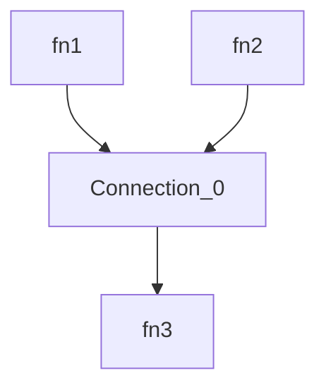
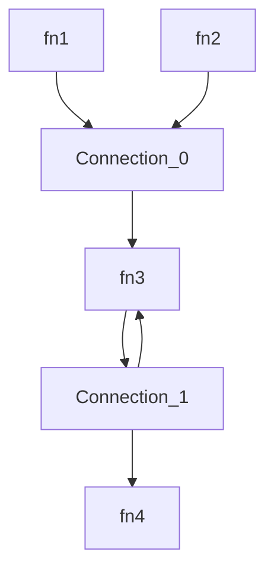

# Isomorphic Orchestrator for JS/TS Functions

This library provides a simple yet powerful, fast, secure, and extensible orchestrator for your JavaScript/Typescript functions, working both in browsers and Node/Bun/Deno, that can be used as base for your own low-code platform.
The orchestration logic is defined in a simple JSON and uses the power of [JSONata](https://jsonata.org/) for input/output transformations.

Highlights:
- Lighweight: The full orchestration logic is ~100 LoC. No dependencies except JSONata.
- Secure: User code provided as a JSONata expression does not need to be sandboxed.
- Extensible: You can provide your own state management system or additional transition logic other than JSONata (TODO).
- Isomorphic: Works in a browser as well as on Node/Bun/Deno.
- Typescript types available.
- Open Source (MIT).
- 100% code coverage.
- Simple [Playground](https://damianofalcioni.github.io/js-functions-orchestrator/index.playground.html)

## Usage

### NodeJS

```shell
npm install js-functions-orchestrator
```

Simple combination of two functions outputs as input for a third one:


```js
import { Orchestrator } from 'js-functions-orchestrator';

const orchestrator = new Orchestrator({
  functions: {
    fn1: async ()=>'Hello', //sync or async functions
    fn2: async ()=>'World',
    fn3: echo=>echo
  }
});
const runResult = await orchestrator.run({
  connections: [{
    from: ['fn1', 'fn2'],
    transition: '{ "to": [[ $.from[0] & " " & $.from[1] ]] }', //the result of fn1 (the string "Hello") is combined with the the result of fn2 (the string "World") and used as input for fn3
    to: ['fn3']
  }]
});

console.log(runResult);
/* output:
{
  results: { fn3: 'Hello World' },
  variables: { global: {}, locals: [ {} ] }
}
*/
```

A more complex scenario with a loop:


```js
import { Orchestrator } from 'js-functions-orchestrator';

const orchestrator = new Orchestrator({
  functions: {
    echo: echo=>echo
  }
});

const runResult = await orchestrator.run({
  //optional list of aliases (in the key) for the available functions (in the value)
  aliases: {
    fn1: 'echo',
    fn2: 'echo',
    fn3: 'echo',
    fn4: 'echo'
  },
  //initial set of functions that starts the orchestration with the array of their input parameters
  inits: {
    fn1: ['hello'],
    fn2: ['world']
  },
  connections: [{
    from: ['fn1', 'fn2'],
    transition: '{ "to": [[ $.from[0] & " " & $.from[1] ]], "global": {"y": 1} }',
    to: ['fn3']
  }, {
    from: ['fn3'],
    transition: '($i:=$.local.i; $i:=($i?$i:0)+1; {"global":{"y":($.global.y+1)}, "local":{"i":$i}, "to": [[ $.from[0] & " " & $string($i)], $i<5 ? [[$.from[0]]] : null ] })',
    to: ['fn4', 'fn3']
  }]
});
console.log(runResult);
/* output:
{
  results: { fn4: 'hello world 5' },
  variables: { global: { y: 6 }, locals: [ {}, { i: 5 } ] }
}
*/
```

More examples are available in the [index.test.js](./index.test.js).

### Browser

Live at [Github Pages](https://damianofalcioni.github.io/js-functions-orchestrator/index.test.html)

Or try it in the [Playground](https://damianofalcioni.github.io/js-functions-orchestrator/index.playground.html)

```html
<html>
<script type="module">
import { Orchestrator } from 'https://esm.run/js-functions-orchestrator';

const orchestrator = new Orchestrator({
  functions: {
    //sync or async functions
    echo: echo=>echo
  }
});
const runResult = await orchestrator.run({
  aliases: {
    fn1: 'echo',
    fn2: 'echo',
    fn3: 'echo'
  },
  inits: {
    fn1: ['Hello'],
    fn2: ['World']
  },
  connections: [{
    from: ['fn1', 'fn2'],
    transition: '{ "to":[[ $.from[0] & " " & $.from[1] ]] }', //the result of fn1 (the string "Hello") is combined with the the result of fn2 (the string "World") and used as input for fn3
    to: ['fn3']
  }]
});
document.body.innerText = JSON.stringify(runResult);
console.log(runResult);
/* output:
{
  results: { fn3: 'Hello World' },
  variables: { global: {}, locals: [ {} ] }
}
*/
</script>
</html>
```

## Logic

The orchestration graph is defined by a list of `connections` between JS/TS functions, and optionally an initial set of starting functions with user-defined inputs, and an optional list of aliases for reusing the available functions without looping them. A single connection can be `from` multiple JS functions `to` multiple JS functions and may include the transformation logic for the outputs of the `from` JS functions to the inputs of the `to` JS functions. After the initial execution of all the functions with user-defined inputs, the different connections loop sequentially and each connection starts only when all the `from` JS functions have Promises of results. Once awaited, their results are provided to the transformation logic and the results of the transformation are the inputs for the different `to` JS functions, which are then executed.

In more details the orchestration logic is the following:

1. Initialization of starting functions with user-defined inputs 
    - The selected functions are executed and their result Promise stored

3. Loop all connections

4. If there are available results for each `"from"` function, the connection starts
    1. Execute the transition
        - JSONata returning `{"to":[…]}`
        - Available `$.from` array, `$.global` object, and `$.local` object
    2. Store the transition results as inputs for all the `"connection.to"` functions
    3. Delete all the `"from"` results
    4. Execute all the `"to"` functions with the available inputs from the transition
        - If the input is `"null"` the function is not executed (loop exit condition)

5. Repeat until no more connections can be started
    - Note: Incorrectly designed graphs can lead to infinite executions.

6. Return all the remaining functions and connections results


## Syntax

```js
{
    // Optional set of aliases (provided in the keys) for the available functions (in the values). This way we can reuse the function without looping through it.
    "aliases": {
      "fn1": "echo",
      "fn2": "echo",
      "fn3": "echo"
    },
    // Functions with user-defined inputs. These functions will start the orchestration. When not defined, initial functions will be identified checking on the connections all the "from" functions that are never connected to a "to".
    "inits": {
        // Key is the identifier of the function, value is the array of expected parameters.
        "fn1": [],
        "fn2": []
    },
    // List of existing connections between functions. The orchestrator will loop through the connections until no one can start.
    "connections": [{
        // A connection require a nonempty "from" array, containing the identifiers of the functions that originate the connection. The connection starts only when all the functions in the "from" array have been executed and have a resulting Promise. In this case all the "from" Promises are awaited, and their results are made available in the JSONata of the "transition".
        "from": ["fn1", "fn2"],
        //JSONata expression that must return at least the JSON { "to": [] }. "to" must be an array of the same size of the "connection.to" array, containing an array of input parameters (as array) for the relative "connection.to" function. Additionally it can return "global", and "local", to store respectively globally and locally scoped variables (a global variable is visible in all the connection transition, while a local variable only in the same transition but across multiple execution). If the transition is not provided the output of the "from" functions are provided directly as inputs to the "to" functions. In this case "from" and "to" arrays must be of the same size.
        "transition": "{\"to\": [[ $.from[0] & \" \" & $.from[1] ]]}",
        // List of functions that can consume the output of the "transition" as their inputs. The functions are executed and next connection is checked until no more connections can start. 
        "to": ["fn3"]
    }]
}
```
